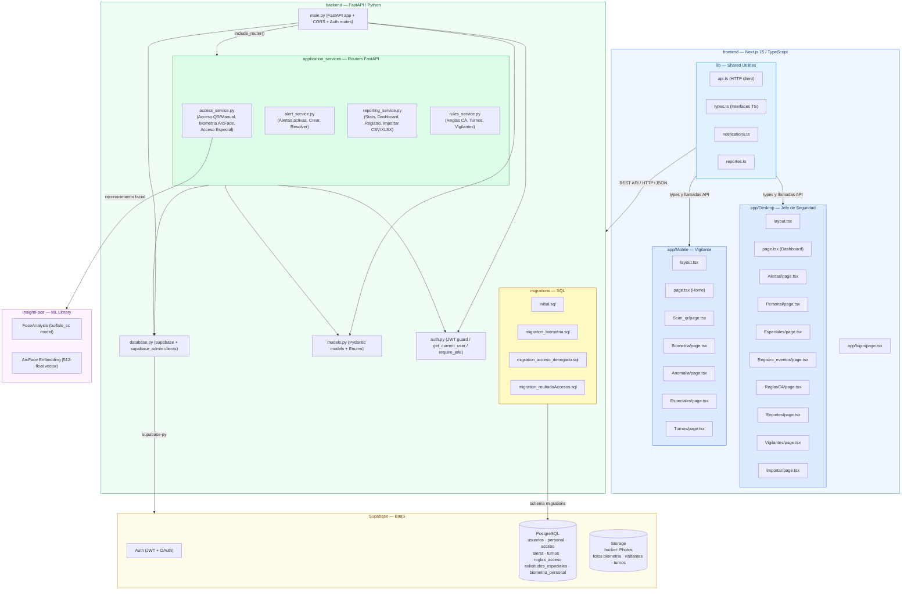

# UdSafe — Diagrama de Paquetes (Vista de Desarrollo)

> **Cómo visualizar:** copia el bloque de código en [mermaid.live](https://mermaid.live) y pégalo en el editor.

```mermaid
graph TD
    subgraph FE["frontend — Next.js 15 / TypeScript"]
        direction TB

        subgraph DESKTOP["app/Desktop — Jefe de Seguridad"]
            d_layout["layout.tsx"]
            d_dashboard["page.tsx (Dashboard)"]
            d_alertas["Alertas/page.tsx"]
            d_personal["Personal/page.tsx"]
            d_especiales["Especiales/page.tsx"]
            d_registro["Registro_eventos/page.tsx"]
            d_reglas["ReglasCA/page.tsx"]
            d_reportes["Reportes/page.tsx"]
            d_vigilantes["Vigilantes/page.tsx"]
            d_importar["Importar/page.tsx"]
        end

        subgraph MOBILE["app/Mobile — Vigilante"]
            m_layout["layout.tsx"]
            m_home["page.tsx (Home)"]
            m_scanqr["Scan_qr/page.tsx"]
            m_biometria["Biometria/page.tsx"]
            m_anomalia["Anomalia/page.tsx"]
            m_especiales["Especiales/page.tsx"]
            m_turnos["Turnos/page.tsx"]
        end

        login_page["app/login/page.tsx"]

        subgraph LIB["lib — Shared Utilities"]
            lib_api["api.ts (HTTP client)"]
            lib_types["types.ts (Interfaces TS)"]
            lib_notif["notifications.ts"]
            lib_reportes["reportes.ts"]
        end
    end

    subgraph BE["backend — FastAPI / Python"]
        direction TB

        main["main.py (FastAPI app + CORS + Auth routes)"]
        models["models.py (Pydantic models + Enums)"]
        auth["auth.py (JWT guard / get_current_user / require_jefe)"]
        database["database.py (supabase + supabase_admin clients)"]

        subgraph SERVICES["application_services — Routers FastAPI"]
            access_svc["access_service.py\n(Acceso QR/Manual, Biometria ArcFace,\nAcceso Especial)"]
            alert_svc["alert_service.py\n(Alertas activas, Crear, Resolver)"]
            reporting_svc["reporting_service.py\n(Stats, Dashboard, Registro, Importar CSV/XLSX)"]
            rules_svc["rules_service.py\n(Reglas CA, Turnos, Vigilantes)"]
        end

        subgraph MIG["migrations — SQL"]
            sql_init["initial.sql"]
            sql_bio["migration_biometria.sql"]
            sql_denied["migration_acceso_denegado.sql"]
            sql_result["migration_reultadoAccesos.sql"]
        end
    end

    subgraph SUPA["Supabase — BaaS"]
        supa_auth["Auth (JWT + OAuth)"]
        supa_db[("PostgreSQL\nusuarios · personal · acceso\nalerta · turnos · reglas_acceso\nsolicitudes_especiales · biometria_personal")]
        supa_storage[("Storage\nbucket: Photos\nfotos biometria · visitantes · turnos")]
    end

    subgraph ML["InsightFace — ML Library"]
        face_app["FaceAnalysis (buffalo_sc model)"]
        arcface["ArcFace Embedding (512-float vector)"]
    end

    %% Dependencias principales
    LIB       -->|"REST API / HTTP+JSON"| BE
    LIB       -->|"types y llamadas API"| DESKTOP
    LIB       -->|"types y llamadas API"| MOBILE

    main      -->|"include_router()"| SERVICES
    main      --> auth
    main      --> database
    main      --> models

    SERVICES  --> models
    SERVICES  --> auth
    SERVICES  --> database

    database  -->|"supabase-py"| SUPA
    access_svc-->|"reconocimiento facial"| ML
    MIG       -->|"schema migrations"| supa_db

    %% Estilos
    style FE       fill:#eff6ff,stroke:#3b82f6,color:#1e3a5f
    style BE       fill:#f0fdf4,stroke:#16a34a,color:#14532d
    style SUPA     fill:#fefce8,stroke:#ca8a04,color:#713f12
    style ML       fill:#fdf4ff,stroke:#a855f7,color:#581c87
    style DESKTOP  fill:#dbeafe,stroke:#2563eb,color:#1e3a5f
    style MOBILE   fill:#dbeafe,stroke:#2563eb,color:#1e3a5f
    style LIB      fill:#e0f2fe,stroke:#0284c7,color:#0c4a6e
    style SERVICES fill:#dcfce7,stroke:#15803d,color:#14532d
    style MIG      fill:#fef9c3,stroke:#b45309,color:#713f12
```
